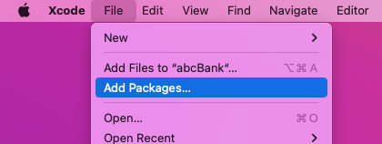
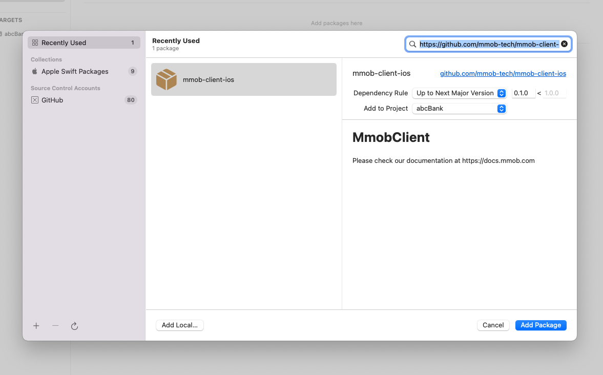
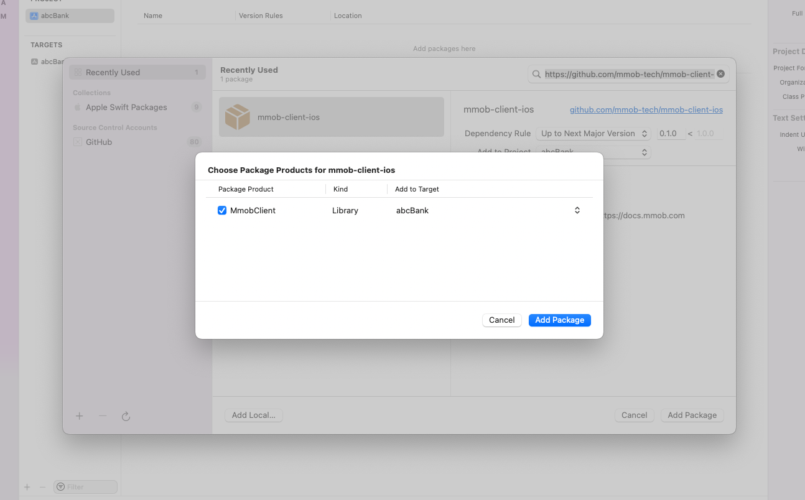
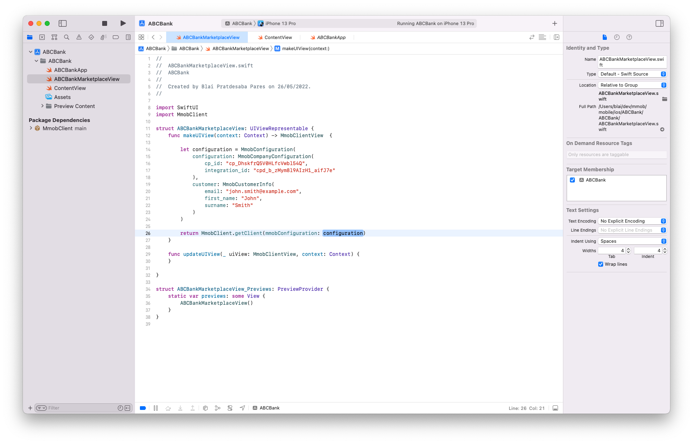
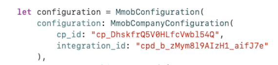
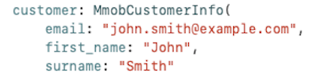
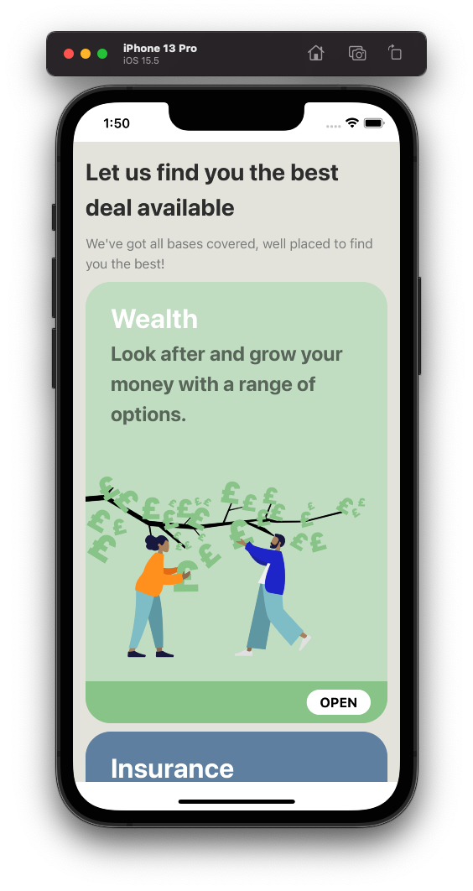

# iOS Installation

Installing mmob's package allows you to unlock a world of onward journeys for your customers, all served natively within your iOS applications. mmob's library supports **iOS 13+**, built using **Xcode 13**.

## Installing your iOS Integration

To install an mmob Integration, the following steps are required:

- Add the mmob Client iOS package to Xcode 13 or later

- Import `MmobClient`

- Set the `configuration` with your organisation's `cp_id` and `integration_id`

- Configure the `customer` snippet

---
### Step 1: Adding Swift Package Manager

To get started, add mmob's package repository in Xcode.

### Step 2: Import mmob Client Package

Click `File` -> `Add Packages`

In the search bar, type https://github.com/mmob-tech/mmob-client-ios.git, on which you will find `mmob-client-ios`.

You will then see the option to `Download Package` - ensure that the tickbox is checked appropriately

---
### Script Breakdown

Your whole script should roughly take this form:

---

### Step 3: Set Configuration to cp_id and integration_id

    let configuration = MmobConfiguration(
    configuration: MmobCompanyConfiguration(
    cp_id: "Your cp_id here"
    integration_id: "Your chosen integration-id here"

### Step 4: Configure the Customer Snippet with the correct parameters

    customer: MmobCustomerInfo(
        email: "john.smith@example.com"
        first_name: "John"
        surname: "Smith"
    )

### Step 5: Update the Client View

    func updateUIView(_ uiView: MmobClientView, context: Context) {
    }
}

On completion of these steps, your integration will load into the ui viewer.

