Introduction
------------

The mmob dashboard allows you to:

*   Curate different products and services for your embedded integration(s)
    
*   Analyse and download customer and order data
    
*   Track usage and performance of your integration(s)
    
*   Access support for troubleshooting purposes
    

Accessing your Dashboard
------------------------

Your dashboard can be accessed globally via [dashboard.mmob.com](http://dashboard.mmob.com). You will need to set up access before you can start using it, using the following process. As part of your organisation’s access, you are able to nominate multiple team members to access the dashboard.

### Setting Up Your Admin Account

To access our network, you’ll first need to set up your admin account on our dashboard. To do this, the following steps apply:

1.  Go to [dashboard.mmob.com](http://dashboard.mmob.com/) and set up your Auth0 login credentials
    

a.     If you do not receive a confirmation within 24 hours, email [contact@mmob.com](mailto:contact@mmob.com) and we can get you set up manually

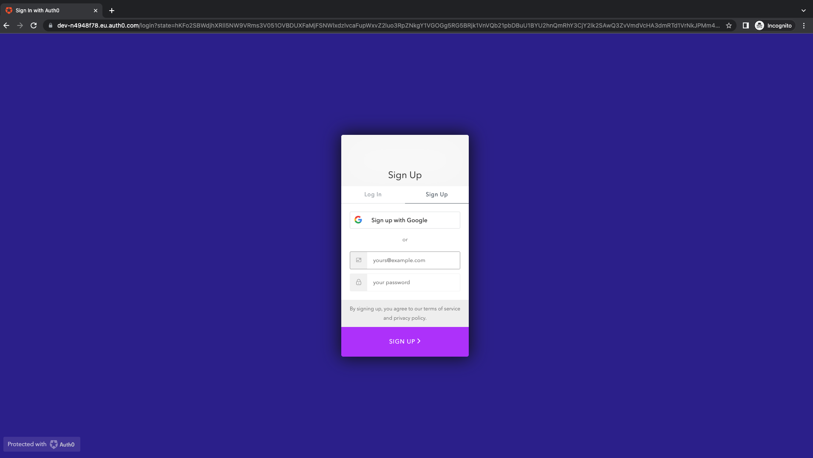

**If you’re setting up your account and integration for the first time, you will want to read the** [https://mmob.atlassian.net/l/c/mmcHK2Lh](https://mmob.atlassian.net/l/c/mmcHK2Lh) **which contains the steps for first-time users.**

Feature Breakdown
-----------------

Now you have gained access to your dashboard, you can explore the following features, which allow you to access the different functions and track performance.

### Analytics

On logging into your dashboard, you will first land on the Analytics tab.

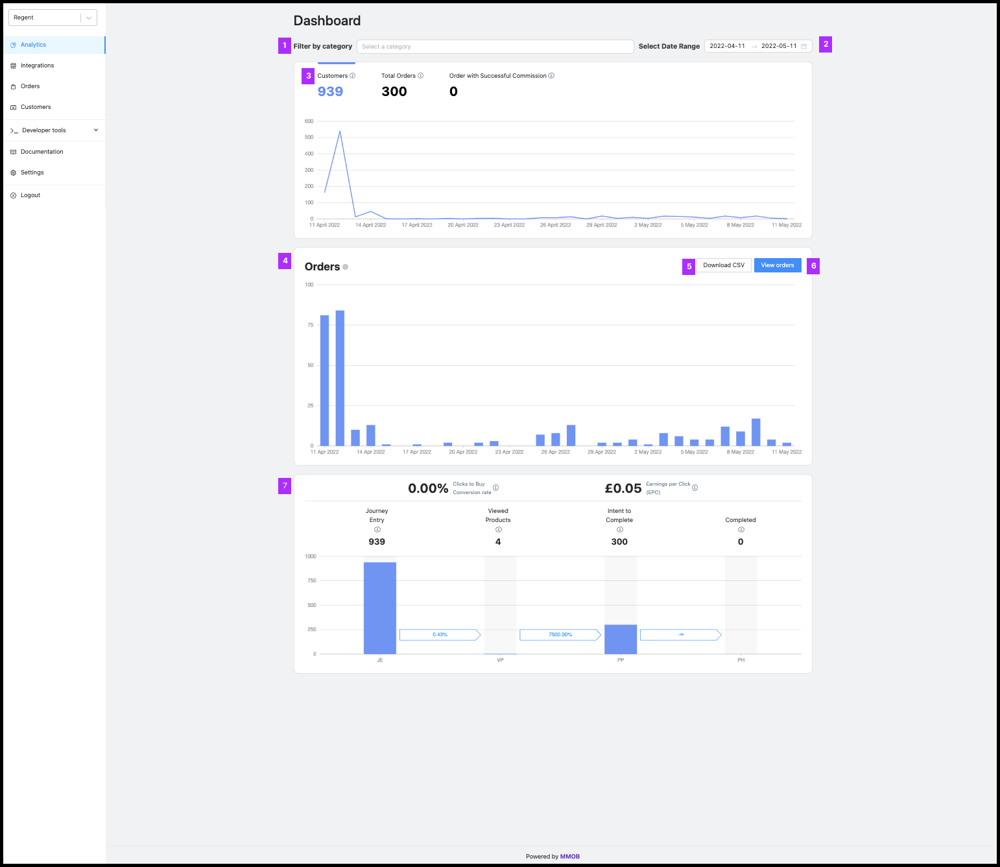

The main features are broken down as follows:

**1\. Filter by Category**

If your organisation has enabled multiple Categories (e.g. Broadband, Credit Cards, Current Accounts), you can filter the analytics down to the category level for individual analysis. All you need to do is type the desired category you want to inspect into the search bar.

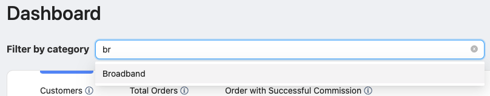

**2\. Select Date Range**

This feature allows you to break down the analysis into custom time periods. Using the tool, you can see the performance for custom time periods.

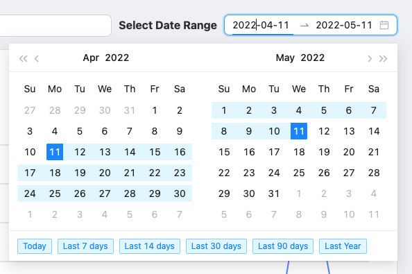

You can default to standard time periods by clicking the blue tabs at the bottom of the date picker.

**3\. Customers and Orders Summary**

This line graph updates with the latest customers and orders information synchronously (i.e. as it happens). For a clarification of each metric, be sure to check out the tooltip on each tab.

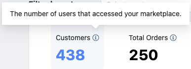

**4\. Download CSV**

This feature allows you to download order and customer data in CSV format. The CSV itself contains User data and event data information useful for reconciliation or analysis at the broad level. Clicking the button will send a CSV to your downloads, and can be opened using most spreadsheet analysis tools such as Excel or Google Sheets.

Tip: to filter down on the parameters you want to set on the data, change the date range and category filters

**5\. View Orders**

Clicking this button will take you to the ‘View Orders’ tab which is expanded on below.

**6\. User Funnel**

The funnel shows your users' progression through the journeys you have initiated. Tooltips give an explanation of each funnel ‘bucket’.

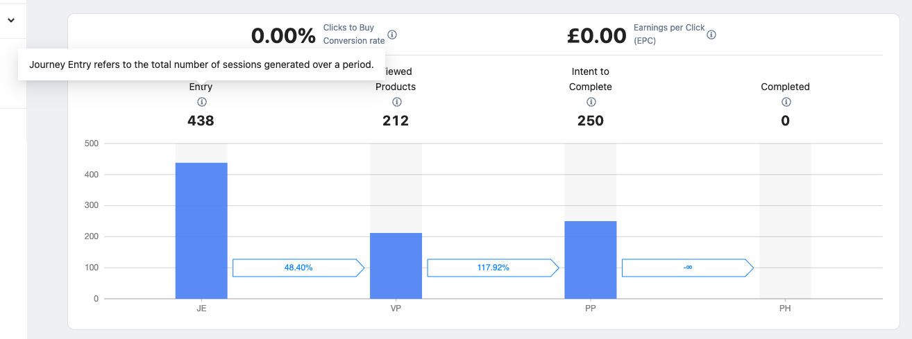

* * *

### Integrations

The Integrations tab allows you to manage the different collections of embedded products and services across your different channels.

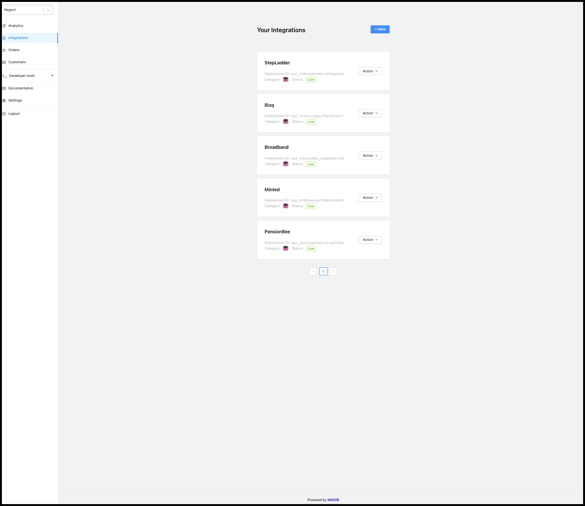

For detailed information on how to create an integration, check out this document: [https://mmob.atlassian.net/l/c/mmcHK2Lh](https://mmob.atlassian.net/l/c/mmcHK2Lh).

* * *

Orders
------

The Orders tab allows you to see order activity as it comes in, as well as commission statuses and performance.

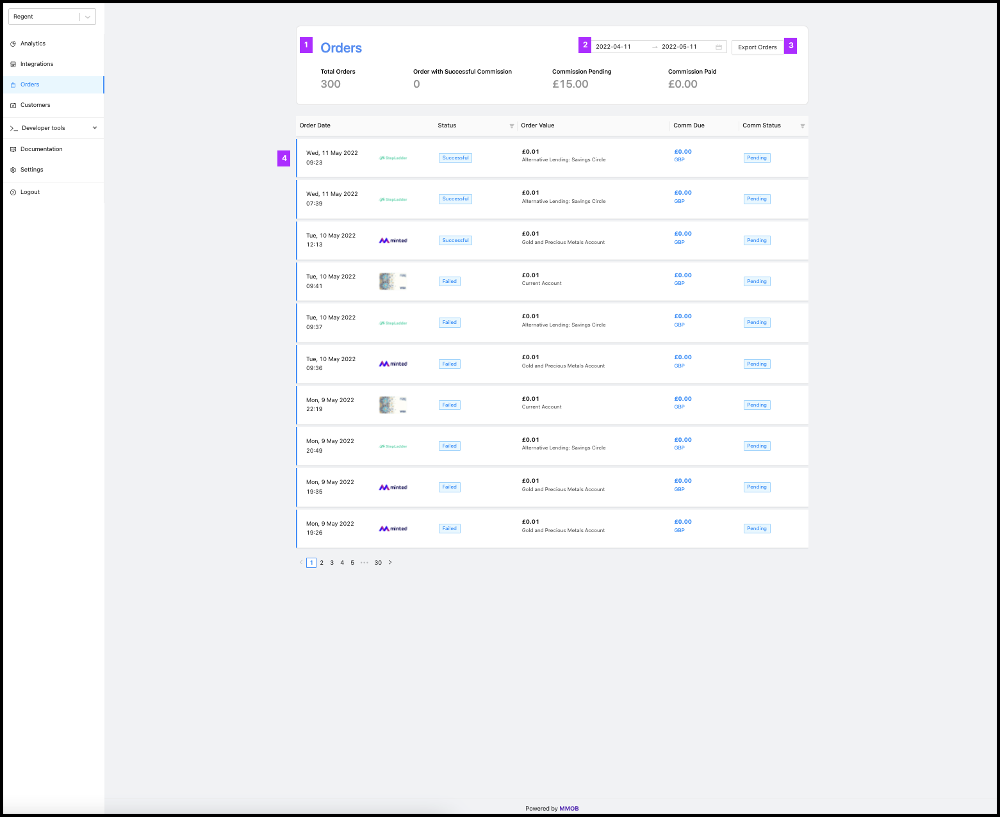

The callouts are as follows:

1.  **Orders**
    

This header summarises the aggregate performance across your integrations.

**2\. Select Date Range**

This feature allows you to break down the analysis into custom time periods. Using the tool, you can see the performance for custom time periods.

**3\. Export Orders**

This feature allows you to download order data in CSV format. The CSV itself contains User data and event data information useful for reconciliation or analysis at the broad level. Clicking the button will send a CSV to your downloads, and can be opened using most spreadsheet analysis tools such as Excel or Google Sheets.

**4\. Order Line Item**

Each order or sign-up which is placed for a product will get its own line item as soon as it is created by the user. A few notes:

*   **Status** \- refers to the success/failure of the delivery of the order.
    
    *   Each journey type has a specific goal in terms of delivering the user data, so as long as this is met, the order status will be marked as SUCCESSFUL.
        
    *   If the status is marked PENDING , the system is awaiting confirmation from an external system that the order has been created and received: this is particularly common with affiliate URL driven products.
        
    *   Finally, if it is marked as FAILED , it means there is an issue with the mmob system with regard to data capture and delivery
        
*   **Comm Status** - refers to the status of the commission due for a User order/ signup. This is dependent on the **Status** initially:
    
    *   If an order’s **status** is anything other than SUCCESSFUL, then its corresponding **comm status** will be N/A
        
    *   If **status** is SUCCESSFUL, then **comm status** can be PENDING, meaning we are waiting on the service provider to confirm when the commission is/will be paid. The amount under PENDING will be logged in the Orders header above under **Commission Pending**
        
    *   Once the service provider has confirmed the commission, the order’s **comm status** will be updated to SUCCESSFUL, and the amount which was previously under **Commission Pending** will move to **Commission Paid**
        
    *   **Comm status** is updated by the service provider, which occurs either through API or manually. For this reason, the wait time to confirm commission for a given order can vary
        

* * *

### Customers

This contains a list of customers which have visited your embedded integrations.

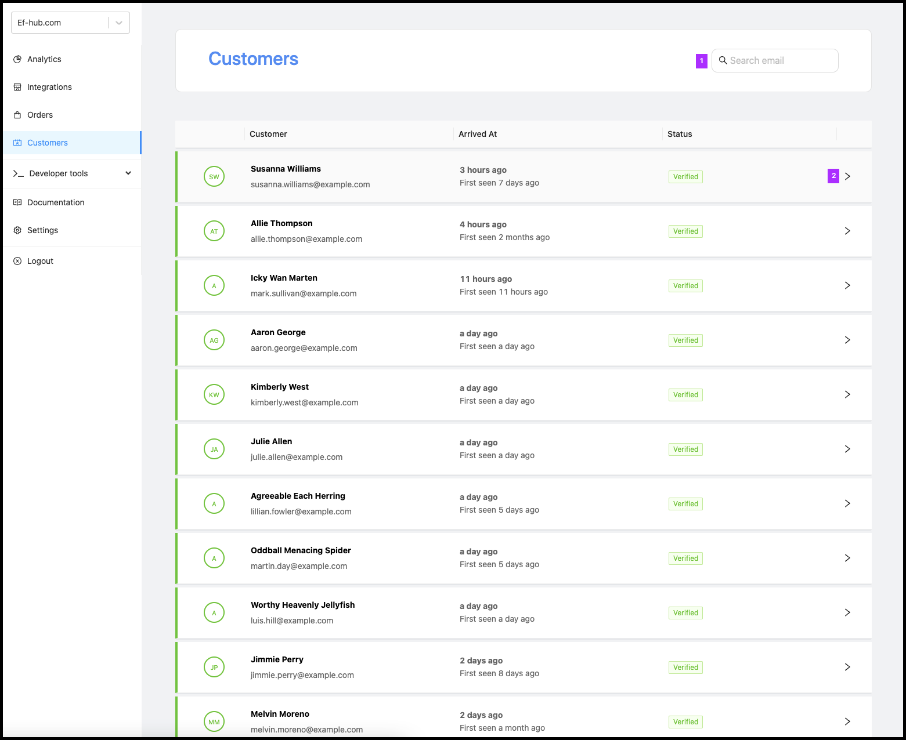

There are two types of user which fall within the scope of a ‘Customer’:

*   Generic User - This a user which can be uniquely identified using email, which is shown above.
    
*   Anonymous User - This is a user for which the system **cannot** assign a unique identifier. In which case, the user line item will display with a random string of words:
    
    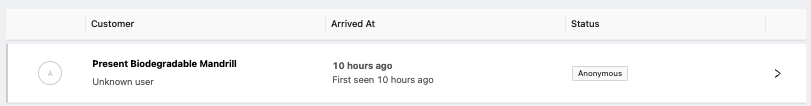

#### Customer Profile

Clicking on the Customer line-item will then open the **Customer Profile** tab.

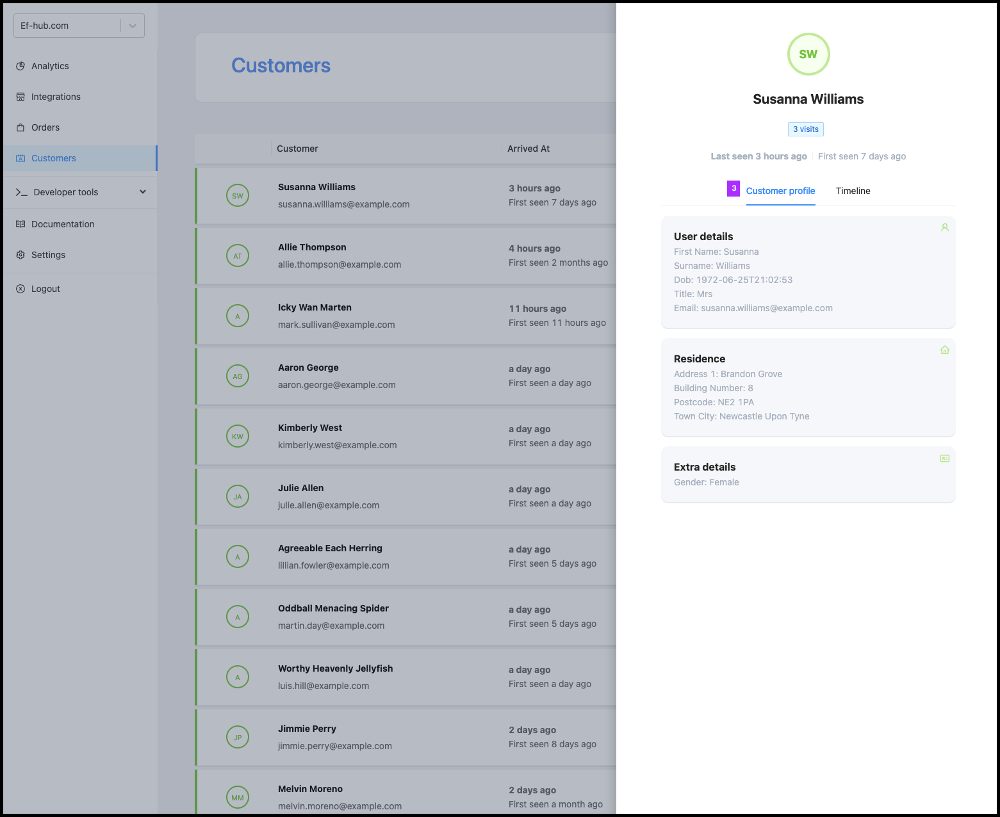

This allows you to see the user details associated with the user in question, as well as information about how and when they they visited your integration.

It’s important to note that the information contained on the profile will not include any subsequent data the user enters on a given service provider journey. For example, if a credit card sign up journey asks for a national insurance number and the user enters it, this will not be available to you as a CP admin user.

#### Timeline

The timeline tab contains all of the user behaviour events available. There are two classes of events, including:

*   User behaviour, measuring different interaction points that a user hits within a given journey
    
*   Funnel Events - These include events where users start journeys, view products make a purchase
    

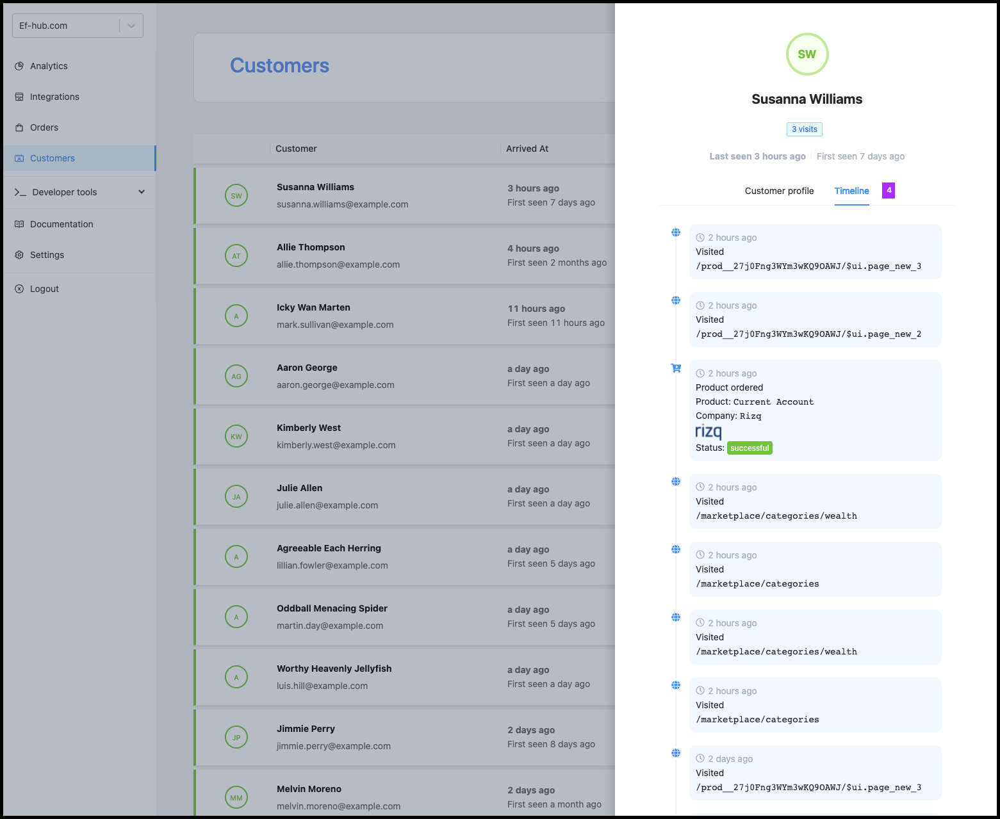

* * *

### Documentation

Clicking documentation will take you to [https://docs.mmob.com/](https://docs.mmob.com/)

* * *

### Settings

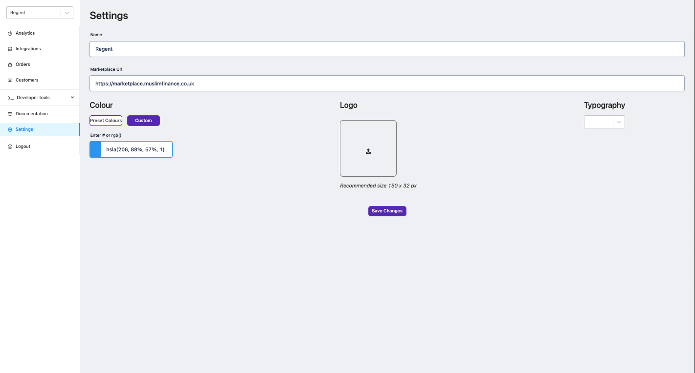

The settings page is where you can configure your marketplace URL, CP Name and the primary colour within your integration. The latter sets your primary colour to Key UI elements such as CTAs.

* * *

End
